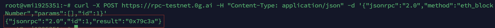
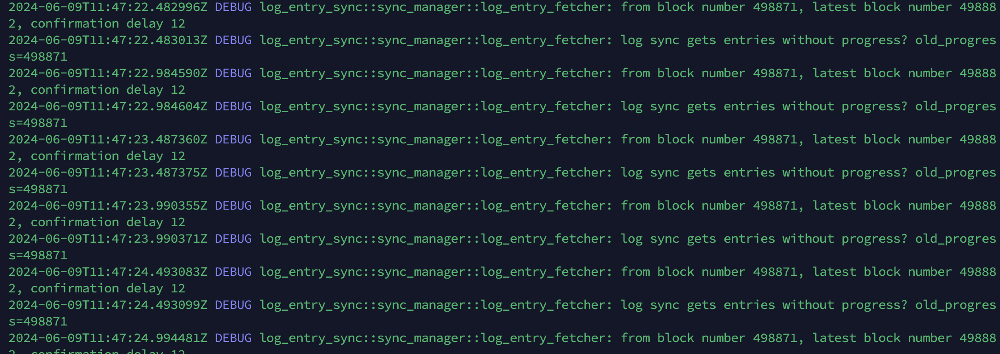

# OG Storage Node

Official documentation:
>- https://docs.0g.ai/0g-doc/run-a-node/storage-node-and-da-services

Faucet:
>- https://faucet.0g.ai

Submit Google form:
>- https://docs.google.com/forms/d/e/1FAIpQLScsa1lpn43F7XAydVlKK_ItLGOkuz2fBmQaZjecDn76kysQsw/viewform?ts=6617a343

## Hardware Requirements 
Minimum
>- 16GB RAM
>- 4Core CPU
>- Disk: 500G NVME SSD
>- Bandwidth: 600 MBps for Download / Upload

| Network | Version | Current | Last modified |
|---------------|-------------|-------------|-------------|
| **zgtendermint_16600-1** | v0.2.0 | Yes |  |
# Install
### You can setup your OG Storage Node in few minutes by using automated script below.
### It will prompt you to input your EVM_PRIVATE_KEY and your BLOCKCHAIN_RPC_ENDPOIT!
#### Get evm private key
Open metamask wallet > Account details > Show private key
#### List rpc endpoint
You can use your own rpc-end-point or use any rpc below:
- https://rpc-testnet.0g.ai
- https://evm-rpc-0g.mflow.tech
- https://0g-rpc.dongqn.com
- https://og-testnet-jsonrpc.blockhub.id
- https://0gevmrpc.nodebrand.xyz

#### Faucet token before install: https://faucet.0g.ai
#### Please check rpc still working before install 
```
curl -X POST <YOUR_RPC_END_POINT> -H "Content-Type: application/json" -d '{"jsonrpc":"2.0","method":"eth_blockNumber","params":[],"id":1}'
```
If you see the same, it's working

### Ok, let's go, setup storage node automatic with one command
```
wget -O ogstorage-auto.sh https://raw.githubusercontent.com/topjsdev/og-guide/main/OG/ogstorage-auto.sh && chmod +x ogstorage-auto.sh && ./ogstorage-auto.sh
```
# Useful commands
#### restart node
```
sudo systemctl restart zgs
```
#### check your log list
```
ls ~/0g-storage-node/run/log/
```
#### check your last log
```
tail -f ~/0g-storage-node/run/log/zgs.log.$(date +%Y-%m-%d)
```
If you see the same, the installation was successful



Question: <a href="https://t.me/nodesrunnerguruchat" target="_blank">NodesRunner Chat</a>
